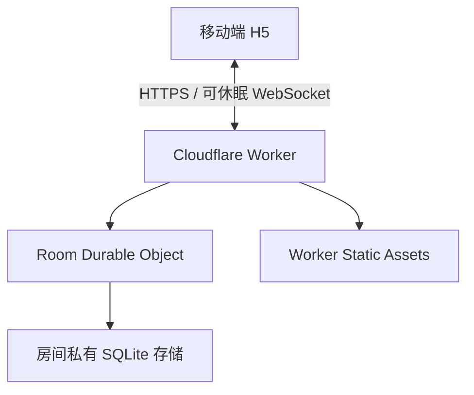
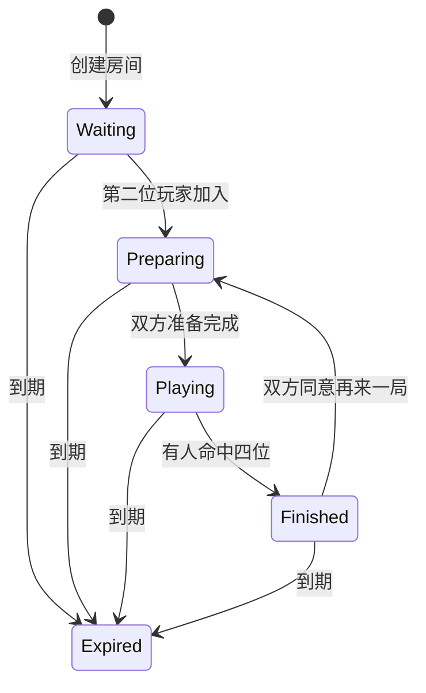

# 数字炸弹：Cloudflare 架构与实施规格

> 文档状态：可直接实施  
> 版本：1.0  
> 日期：2026-07-17  
> 目标读者：负责下一阶段编码、部署和验收的开发 Agent

## 1. 项目目标

构建一个适合两个人在手机上轮流猜数字的轻量游戏。第一阶段以移动端 H5 形式发布，通过链接或房间码邀请对方，不要求注册、微信登录或安装 App。

系统首先服务于两位固定玩家，同时架构应当在不迁移、不扩容、不维护服务器的前提下自然支撑数百到约一千 DAU。

核心目标：

- 一个代码仓库、一个 Cloudflare 项目、一次部署。
- 不依赖阿里云或自建常驻服务器。
- 不使用 Redis、独立数据库、消息队列或微服务。
- 双方操作近实时同步，支持微信切后台后的断线重连。
- 秘密数字只在服务端判定，不提前发送给对手。
- 房间短期持久化，到期自动彻底删除。
- UI 简洁、有游戏感，但不提供算法提示或最优解。

## 2. 明确不做的内容

第一版不实现：

- 用户注册、微信登录、手机号登录。
- 好友系统、陌生人匹配、排行榜。
- AI、候选数字、概率分析、自动排除或最优策略。
- 观战、群聊、语音、道具、成就、多于两人的模式。
- 永久战绩与跨设备账号同步。
- 原生微信小程序。先以微信内可打开的 H5 实现。
- 阿里云兜底或双云部署。

除非产品需求被明确修改，实施 Agent 不应自行扩展以上范围。

## 3. 游戏规则（服务端权威规则）

1. 每名玩家设置一个四位数字密码。
2. 密码与猜测均匹配正则 `^\d{4}$`。
3. 允许重复数字，例如 `3333`。
4. 允许以 `0` 开头，例如 `0123`；它是四字符密码，不是整数。
5. 每次猜测只计算“数字和位置均正确”的数量。
6. 不反馈“数字正确但位置错误”，也不透露具体命中的位置。
7. 双方严格轮流猜，每次只能提交一个猜测。
8. 第一局使用密码学安全随机数决定先手。
9. 后续对局由上一局输家先手。
10. 一方命中四位时立即获胜，另一方没有追加回合。
11. 一次 `turn` 表示一名玩家的一次猜测；UI 将相邻两个 turn 组合显示为一“轮”。
12. 每局结束后公开双方密码，供双方复盘和验证。

命中计算：

```ts
export function countExactHits(secret: string, guess: string): number {
  assertFourDigits(secret);
  assertFourDigits(guess);

  let hits = 0;
  for (let index = 0; index < 4; index += 1) {
    if (secret[index] === guess[index]) hits += 1;
  }
  return hits;
}
```

## 4. 最终技术选型

### 4.1 Cloudflare 组件

只使用以下能力：

| 能力 | 用途 |
| --- | --- |
| Workers Static Assets | 托管前端静态文件和 SPA fallback |
| Cloudflare Worker | HTTP 路由、创建/加入房间、签发与验证短时 WebSocket ticket |
| Durable Objects（SQLite backend） | 每房间的权威状态、串行化操作、WebSocket 和持久化 |
| Durable Object Alarms | 房间到期清理 |
| Workers Logs / Analytics | 基础运行观测 |

第一版明确不使用 Pages、D1、KV、R2、Queues。Workers Static Assets 与 API 使用同一个 Worker 部署，减少项目和配置数量。

### 4.2 前后端技术

- TypeScript 全栈。
- 前端：React + Vite。
- 前端状态：React reducer/context；不引入 Redux。
- 样式：普通 CSS 或 CSS Modules；不要求组件库和 Tailwind。
- 后端：原生 Worker `fetch` 路由即可；不要为了少量路由引入大型框架。
- 测试：Vitest、Cloudflare Workers 测试池、Playwright。
- 包管理器：npm。

若实施 Agent对 React 有明确的仓库级约束，可使用 Vue 3，但不得改变协议与后端架构。没有既有约束时使用 React。

## 5. 总体架构



### 5.1 请求路径

1. 静态文件请求由 Worker Static Assets 直接处理。
2. `/api/*` 请求优先进入 Worker。
3. Worker 根据房间码使用 `idFromName(roomCode)` 定位唯一 Durable Object。
4. HTTP 创建、加入、签发 ticket 等命令由 Worker转发给对应房间对象。
5. WebSocket Upgrade 由 Worker 验证短时 ticket 后转发至对应房间对象。
6. 后续游戏命令直接通过 WebSocket 到达房间对象。

### 5.2 每房间一个 Durable Object

房间码与 Durable Object 一一对应：

```ts
const objectId = env.ROOMS.idFromName(roomCode);
const room = env.ROOMS.get(objectId);
```

不建立全局“房间码到 ID”映射，不需要 KV 或 D1。房间状态只由自己的 Durable Object 读写，同一房间的事件天然串行处理。

## 6. 项目结构

```text
digital-bomb/
├── src/
│   ├── worker/
│   │   ├── index.ts              # Worker fetch 入口与路由
│   │   ├── auth.ts               # token hash、ticket 签发与验证
│   │   └── responses.ts          # JSON、安全响应头、错误映射
│   ├── room/
│   │   ├── room.ts               # Durable Object 类
│   │   ├── engine.ts             # 纯游戏状态转换
│   │   ├── storage.ts            # 状态加载、保存、删除
│   │   └── public-view.ts        # 按玩家脱敏生成公开状态
│   └── shared/
│       ├── protocol.ts            # 前后端共享消息协议
│       ├── domain.ts              # RoomState、Game、Turn 等类型
│       └── validation.ts          # 输入校验
├── web/
│   ├── src/
│   │   ├── app/
│   │   ├── components/
│   │   ├── screens/
│   │   ├── transport/
│   │   └── styles/
│   └── index.html
├── tests/
│   ├── unit/
│   ├── integration/
│   └── e2e/
├── wrangler.jsonc
├── vite.config.ts
├── vitest.config.ts
├── package.json
└── README.md
```

`engine.ts` 必须是与 Cloudflare 无关的纯 TypeScript。它接收状态和命令，返回新状态或领域错误。这样便于完整单元测试，也保留将来迁移运行时的可能性。

## 7. 领域数据模型

房间状态建议作为一条结构化 JSON 保存在 Durable Object storage 中。单房间数据很小，整条读写比拆分关系表更容易保持原子性，也减少实现复杂度。

```ts
type RoomPhase = "waiting" | "preparing" | "playing" | "finished";

type PrivatePlayer = {
  id: string;
  seat: 1 | 2;
  name: string;
  tokenHash: string;
  secret: string | null;
  ready: boolean;
};

type Turn = {
  turnNumber: number;
  playerId: string;
  guess: string;
  hits: 0 | 1 | 2 | 3 | 4;
  createdAt: number;
};

type Game = {
  gameNumber: number;
  firstPlayerId: string;
  currentPlayerId: string | null;
  winnerPlayerId: string | null;
  loserPlayerId: string | null;
  startedAt: number;
  finishedAt: number | null;
  turns: Turn[];
};

type ProcessedCommand = {
  commandId: string;
  playerId: string;
  resultingVersion: number;
};

type RoomState = {
  schemaVersion: 1;
  roomCode: string;
  phase: RoomPhase;
  version: number;
  players: PrivatePlayer[];
  currentGame: Game | null;
  completedGames: Game[];
  previousLoserId: string | null;
  rematchReadyPlayerIds: string[];
  processedCommands: ProcessedCommand[];
  createdAt: number;
  lastActivityAt: number;
  expiresAt: number;
};
```

约束：

- `players.length` 只能是 1 或 2。
- `completedGames` 最多保留最近 20 局，超过后删除最早记录。
- `processedCommands` 每名玩家最多保留最近 32 条，用于幂等处理。
- presence/connected 不持久化；根据当前 WebSocket attachments 动态推导。
- 每次有效领域操作将 `version` 加一。
- 日志中禁止输出 `secret`、玩家长期 token 和完整 ticket。

## 8. 状态机



### 8.1 创建与加入

- 创建房间后，创建者为 seat 1，阶段为 `waiting`。
- 第二名玩家加入后成为 seat 2，阶段切换为 `preparing`。
- 第三名玩家加入必须返回 `ROOM_FULL`。
- 同一玩家凭长期 player token 重进时恢复原座位，不创建新玩家。

### 8.2 准备

- `ready.set` 同时提交四位秘密数字并锁定。
- 游戏开始前可以 `ready.unset`，取消后清除该玩家秘密数字。
- 第二个人的 `ready.set` 使双方同时 ready 时，服务端在同一原子状态转换内开始游戏。
- 一旦进入 `playing`，秘密数字不能修改或取消准备。

### 8.3 开始游戏

- 第一局：使用 `crypto.getRandomValues` 或等价安全随机源从两人中选择先手。
- 后续局：`previousLoserId` 为先手。
- 进入 `playing` 后设置 `currentGame.currentPlayerId`。

### 8.4 提交猜测

按顺序验证：

1. 玩家身份有效。
2. 房间处于 `playing`。
3. `expectedVersion` 等于当前版本，或命令已被幂等处理。
4. 当前确实轮到该玩家。
5. `guess` 符合四位数字规则。
6. 计算命中数量并追加 turn。
7. 命中 4 位则立即结束；否则切换 `currentPlayerId`。

### 8.5 结束与再来一局

- 命中四位后将 winner、loser、finishedAt 写入当前 Game。
- 阶段切换为 `finished`，双方私密数字此时可以公开展示。
- 每名玩家分别发送 `rematch.set`。
- 双方都同意后，把当前 Game 放入 `completedGames`，清空双方秘密数字和 ready 状态，进入 `preparing`。
- 下一局双方必须重新设置秘密数字。
- 上一局输家成为下一局先手。

## 9. 身份与安全边界

### 9.1 房间码

使用以下无歧义字符集生成 6 位房间码：

```text
ABCDEFGHJKLMNPQRSTUVWXYZ23456789
```

排除 `0/O`、`1/I`。随机源必须使用 Web Crypto，不得使用 `Math.random()`。

创建时若目标 Durable Object 已初始化，重新生成房间码，最多重试 5 次。

### 9.2 玩家长期 token

- 创建或加入成功后生成至少 128 bit 随机 `playerToken`。
- 原始 token 只返回客户端一次，并存储于 `localStorage`。
- 服务端只保存 SHA-256 hash，不保存原文。
- 后续 HTTP 鉴权使用 `Authorization: Bearer <playerToken>`。
- 昵称不是身份凭证。

### 9.3 短时 WebSocket ticket

不要把长期 `playerToken` 放入 WebSocket URL。

连接前调用：

```http
POST /api/rooms/{roomCode}/socket-ticket
Authorization: Bearer <playerToken>
```

服务端验证后返回 60 秒有效的签名 ticket。ticket 至少包含：

```ts
type SocketTicketClaims = {
  roomCode: string;
  playerId: string;
  expiresAt: number;
  nonce: string;
};
```

使用 Worker secret `WS_TICKET_SECRET` 进行 HMAC-SHA-256 签名。WebSocket 连接：

```text
wss://game.example.com/api/rooms/7KF2MT/socket?ticket=<short-lived-ticket>
```

Worker 验证签名、房间码和有效期后，将可信 playerId 传给 Durable Object。ticket 即便出现在短期日志中也很快失效。第一版不强制一次性消费 nonce；60 秒有效期已经足够，后续若发现重放风险再增加 nonce 表。

### 9.4 信息脱敏

每次发送状态时，必须按接收玩家生成独立 public view：

- 游戏结束前：玩家只能看到自己的秘密数字；对方 secret 始终为 `null`/省略。
- 游戏结束后：双方都能看到两人的秘密数字。
- tokenHash、processedCommands 永远不发送到客户端。
- 不允许直接序列化 `RoomState` 后广播。

必须通过单一函数实现：

```ts
toPublicRoomView(privateState, viewerPlayerId, presence): PublicRoomView
```

并为脱敏逻辑编写独立测试。

### 9.5 Web 安全

- 仅允许同源 API；不开放宽泛 CORS。
- 设置 CSP、`X-Content-Type-Options: nosniff`、`Referrer-Policy: no-referrer`。
- 所有输入有长度限制；昵称建议 1～16 个可见字符。
- 房间码、昵称和消息内容在渲染时按文本处理，禁止注入 HTML。
- 对创建和加入接口设置基础速率限制；可先使用 Cloudflare 规则，或在 Worker 中做轻量限制。
- 领域错误返回稳定错误码，不向客户端返回内部堆栈。

## 10. HTTP API

所有响应使用 JSON。成功响应包含 `requestId`；错误响应采用：

```json
{
  "error": {
    "code": "ROOM_NOT_FOUND",
    "message": "房间不存在或已经过期"
  },
  "requestId": "..."
}
```

### 10.1 创建房间

```http
POST /api/rooms
Content-Type: application/json

{ "name": "Ethan" }
```

```json
{
  "roomCode": "7KF2MT",
  "playerToken": "...",
  "roomUrl": "https://game.example.com/r/7KF2MT"
}
```

### 10.2 加入房间

```http
POST /api/rooms/7KF2MT/join
Content-Type: application/json

{ "name": "媳妇" }
```

成功返回 `playerToken` 与初始公开状态。房间已满返回 409 `ROOM_FULL`；过期或不存在返回 404 `ROOM_NOT_FOUND`。

### 10.3 获取 WebSocket ticket

```http
POST /api/rooms/7KF2MT/socket-ticket
Authorization: Bearer <playerToken>
```

```json
{
  "ticket": "...",
  "expiresAt": 1784260800000
}
```

### 10.4 WebSocket Upgrade

```http
GET /api/rooms/7KF2MT/socket?ticket=...
Upgrade: websocket
```

连接成功后，Durable Object 必须立即给当前玩家发送完整 `room.snapshot`，不依赖客户端额外请求。

## 11. WebSocket 协议

消息格式统一为：

```ts
type ClientCommand<TType extends string, TPayload> = {
  type: TType;
  commandId: string;
  expectedVersion: number;
  payload: TPayload;
};
```

客户端命令：

```ts
type ReadySet = ClientCommand<"ready.set", { secret: string }>;
type ReadyUnset = ClientCommand<"ready.unset", Record<string, never>>;
type GuessSubmit = ClientCommand<"guess.submit", { guess: string }>;
type RematchSet = ClientCommand<"rematch.set", { ready: boolean }>;
type StateRequest = ClientCommand<"state.request", Record<string, never>>;
```

服务端消息：

```ts
type RoomSnapshot = {
  type: "room.snapshot";
  version: number;
  state: PublicRoomView;
};

type RoomUpdated = {
  type: "room.updated";
  version: number;
  cause: PublicCause;
  state: PublicRoomView;
};

type CommandError = {
  type: "command.error";
  commandId: string;
  code: DomainErrorCode;
  message: string;
  currentVersion: number;
};
```

`PublicCause` 用于驱动动画而不要求客户端比较整个快照：

```ts
type PublicCause =
  | { type: "player.joined"; playerId: string }
  | { type: "ready.changed"; playerId: string; ready: boolean }
  | { type: "game.started"; firstPlayerId: string }
  | {
      type: "guess.resolved";
      playerId: string;
      guess: string;
      hits: 0 | 1 | 2 | 3 | 4;
      won: boolean;
    }
  | { type: "rematch.changed"; playerId: string; ready: boolean }
  | { type: "game.reset"; firstPlayerId: string };
```

每个接收者都得到按其身份脱敏后的 state。服务端发出的 WebSocket 消息无需长期持久化；权威状态已经在 RoomState 中。

### 11.1 幂等与版本冲突

- 客户端每个命令生成 UUID `commandId`。
- 服务端保存每名玩家最近 32 个已处理 commandId。
- 若收到已处理 commandId，返回当前 snapshot，不重复执行。
- 若 commandId 未处理且 expectedVersion 过期，返回 `VERSION_CONFLICT` 和当前版本；客户端随后以 snapshot 覆盖本地状态。
- UI 在命令未确认时禁用重复提交按钮，但服务端仍必须幂等。

## 12. WebSocket Hibernation 实现要求

必须使用 Durable Object Hibernation API：

- 使用 `ctx.acceptWebSocket(serverSocket)`。
- 不使用普通 `webSocket.accept()` 保持对象常驻。
- 使用 `serializeAttachment` 保存最小连接身份：playerId、连接建立时间和可选客户端版本。
- Durable Object constructor 中不得假设内存状态仍存在。
- 每次唤醒可从 storage 加载权威 RoomState。
- presence 使用 `ctx.getWebSockets()` 与 attachment 推导。
- 不做业务层高频 ping。尽量使用 Cloudflare 的协议 ping/自动响应能力。

一个玩家可能因为刷新暂时存在两条连接。默认策略：接受新连接后关闭该玩家旧连接，关闭码使用应用自定义、可重试的正常替换语义。

## 13. 存储与清理

### 13.1 存储方式

使用 SQLite-backed Durable Object storage，但第一版可通过 storage KV-style API 保存单个键：

```text
key: room_state
value: RoomState JSON
```

每个有效状态转换执行一次保存。无效命令、presence 变化和 WebSocket ping 不写存储。

### 13.2 过期策略

| 房间状态 | 过期时间 |
| --- | --- |
| 只有创建者、等待加入 | 创建或最后活动后 2 小时 |
| preparing / playing | 最后有效游戏操作后 24 小时 |
| finished | 最后活动后 7 天 |

每次有效领域操作更新 `lastActivityAt`、`expiresAt`，并设置/更新 Alarm。

Alarm 触发时：

1. 加载状态。
2. 如果当前时间早于新的 `expiresAt`，重新设置 Alarm 后结束。
3. 否则向连接中的客户端发送 `room.expired`。
4. 关闭所有 WebSocket。
5. 调用 `storage.deleteAll()`，彻底删除状态及 Alarm。

不要仅删除 `room_state` 键；使用 `deleteAll()` 避免残留 SQLite 元数据持续占用存储。

## 14. UI 与交互规格

### 14.1 视觉原则

- 以手机竖屏为主，桌面端居中显示最大宽度约 480px。
- 不采用赌场、金币、排行榜风格；更像两个人之间的一张轻桌游。
- 两名玩家始终使用固定区分色，但颜色不能是唯一信息表达方式。
- 关键触控目标至少 44px。
- 不高亮具体猜对的位置。
- 动画短、可跳过，尊重 `prefers-reduced-motion`。

### 14.2 页面与状态

前端可实现为单页应用，包含以下屏幕状态：

#### 首页

- 品牌/游戏名。
- 一句话规则：“猜中数字和位置，先找出对方的四位密码。”
- 主按钮“创建房间”。
- 次入口“输入房间码”。
- 首次创建/加入时填写昵称，之后记住上次昵称。

#### 等待对方

- 显示房间码。
- 复制邀请链接、系统分享、二维码（二维码可后续实现，若增加依赖则不是阻塞项）。
- 两个座位及状态。
- 明确提示“等待对方加入”。

#### 设置秘密数字

- 四个数字格。
- 自定义 0～9 数字键盘、删除和清空。
- 可见/隐藏切换；离开输入状态后默认隐藏。
- 按钮文案“我准备好了”。
- 已准备后显示锁定状态和“取消准备”；进入 playing 后不再允许取消。

#### 决定先手

- 第一局展示约 1 秒的轻量随机动画。
- 后续局明确显示“上一局输家先手”。
- 动画只由 `game.started` cause 触发，刷新页面不重复播放长动画。

#### 游戏页

顶部：

- 两名玩家姓名、座位和连接状态。
- 当前第几局、第几轮。
- 当前轮到谁。
- 自己的秘密数字可按住或点击眼睛临时查看。

当前操作区：

- 轮到自己：显示四位输入格、自定义数字键盘和“就猜 3313”按钮。
- 未输满四位时按钮禁用。
- 提交后按钮保持禁用，直到服务端确认。
- 轮到对方：隐藏/禁用键盘，显示“她正在想……”等等待文案。

结果反馈：

| hits | 默认文案 |
| ---: | --- |
| 0 | 一个没中 |
| 1 | 命中 1 位 |
| 2 | 命中 2 位 |
| 3 | 只差 1 位 |
| 4 | 全部命中 |

反馈动画建议 0.8～1.2 秒；动画期间状态已经由服务端切换，不能阻塞协议处理。

历史记录按轮分组：

```text
第 3 轮
Ethan  猜了 3313    命中 3 位
媳妇   正在思考…
```

分组规则以当局先手为准，每两个连续 turn 为一轮；如果先手在一轮第一回合获胜，该轮只有一条记录。

#### 结算页

- 胜者、完整命中数字。
- 本局双方分别猜测次数。
- 公开双方秘密数字。
- 可展开完整历史。
- 主按钮“再来一局”。
- 等待对方同意时展示明确状态，并允许取消自己的再来一局意愿。

### 14.3 连接异常

- 正常连接状态不需要醒目展示。
- 对方断线后显示“对方暂时离开，回来后可以继续”，不结束房间。
- 本机断线后自动指数退避重连：1s、2s、4s、8s，之后上限 15s。
- 每次重连先重新获取短时 ticket。
- 回到前台或 `online` 事件触发时立即重连，不等待退避计时器。
- 重连成功后以服务端 snapshot 完整覆盖本地权威状态。

## 15. Cloudflare 配置基线

以下配置为方向性基线，实施时根据实际构建目录调整：

```jsonc
{
  "$schema": "node_modules/wrangler/config-schema.json",
  "name": "digital-bomb",
  "main": "src/worker/index.ts",
  "compatibility_date": "2026-07-01",
  "assets": {
    "directory": "./dist/client",
    "binding": "ASSETS",
    "not_found_handling": "single-page-application",
    "run_worker_first": ["/api/*"]
  },
  "durable_objects": {
    "bindings": [
      {
        "name": "ROOMS",
        "class_name": "Room"
      }
    ]
  },
  "migrations": [
    {
      "tag": "v1",
      "new_sqlite_classes": ["Room"]
    }
  ],
  "observability": {
    "enabled": true
  }
}
```

必须通过 secret 配置：

```text
WS_TICKET_SECRET
```

自定义域名在 Cloudflare Dashboard 或 Wrangler route 中配置。生产环境只接受正式域名；本地开发允许 localhost。

## 16. 可观测性与运维

目标是无需日常人工运维，但必须能快速判断故障。

结构化日志字段：

```ts
{
  requestId,
  roomRef,       // 房间码的不可逆短 hash，不记录原码亦可
  eventType,
  roomPhase,
  roomVersion,
  durationMs,
  errorCode
}
```

禁止记录：

- secret。
- playerToken 或 tokenHash。
- 完整 WebSocket ticket。
- 完整 Authorization header。

建议观测：

- HTTP 5xx 率。
- WebSocket Upgrade 失败率。
- `VERSION_CONFLICT`、`NOT_YOUR_TURN` 数量。
- Durable Object 异常与 Alarm 失败。
- Worker/DO 免费额度使用量。

稳定出现数百 DAU 后，建议开 Workers Paid（基础费用每月 5 美元），避免免费额度硬性超限导致请求失败；无需在首发前强制开通。

## 17. 错误码

至少实现以下稳定错误码：

| 错误码 | 含义 |
| --- | --- |
| `INVALID_INPUT` | 输入格式错误 |
| `INVALID_NAME` | 昵称不合法 |
| `INVALID_SECRET` | 秘密数字不是四位数字 |
| `INVALID_GUESS` | 猜测不是四位数字 |
| `ROOM_NOT_FOUND` | 房间不存在或已过期 |
| `ROOM_FULL` | 房间已有两名玩家 |
| `UNAUTHORIZED` | 玩家 token 无效 |
| `TICKET_INVALID` | WebSocket ticket 无效或过期 |
| `WRONG_PHASE` | 当前房间阶段不允许该操作 |
| `NOT_YOUR_TURN` | 尚未轮到当前玩家 |
| `VERSION_CONFLICT` | 客户端版本已过期 |
| `ALREADY_READY` | 玩家已经准备完成 |
| `COMMAND_REJECTED` | 其他领域拒绝 |
| `INTERNAL_ERROR` | 未预期服务端错误 |

客户端根据 code 决定行为，不依赖 message 文案做逻辑判断。

## 18. 测试计划

### 18.1 纯单元测试

覆盖 `engine.ts`：

- `3333` 对 `1111` 命中 0。
- 重复数字按位置分别计算。
- `0123` 被视为合法四位密码。
- 非四位数字被拒绝。
- 第一局先手只可能是两名玩家之一。
- 后续局输家先手。
- 非当前玩家不能猜。
- 命中 4 位立即结束。
- 结束后不能继续猜。
- 双方同意后正确重置新局。
- completedGames 与 processedCommands 正确裁剪。

### 18.2 Durable Object 集成测试

- 创建、加入、第三人加入拒绝。
- 双方同时 ready 只启动一次游戏。
- 两个并发 guess 只有合法当前玩家成功。
- 重复 commandId 不产生第二条 turn。
- 过期 expectedVersion 返回冲突。
- 休眠/重新构造后从存储恢复完整状态。
- WebSocket attachment 能恢复玩家身份。
- 每个玩家收到不同的脱敏 public view。
- 游戏结束前绝不泄露对方 secret。
- Alarm 到期执行 deleteAll。

### 18.3 E2E 测试

使用两个 Playwright browser context 模拟两台手机：

1. 玩家 A 创建并分享房间。
2. 玩家 B 加入。
3. 双方设置重复数字并准备。
4. 验证随机先手和轮流限制。
5. 完成多轮猜测并验证历史展示。
6. 一方刷新页面后恢复身份和状态。
7. 一方断线，另一方看到 presence 变化。
8. 命中四位后双方看到正确结算。
9. 双方再来一局，验证上一局输家先手。

### 18.4 手工移动端验收

- iOS 微信内置浏览器。
- Android 微信内置浏览器。
- Safari、Chrome。
- Wi-Fi 和移动网络切换。
- 锁屏/切后台 1～5 分钟后恢复。
- 两台设备同时提交边界操作。

Cloudflare 国内可用性已经由产品方验证，本阶段不再把网络可达性作为架构阻塞项。

## 19. 实施顺序

实施 Agent 应按以下顺序工作，每一阶段保持可测试：

1. 初始化 TypeScript、Vite、Worker Static Assets 与 Durable Object 工程。
2. 实现共享领域类型、校验和纯 `engine.ts`，完成单元测试。
3. 实现 RoomState storage、初始化、加入和状态转换。
4. 实现 playerToken、短时 WebSocket ticket 与 HTTP API。
5. 实现 Hibernation WebSocket、attachments、脱敏广播、幂等和重连。
6. 实现 Alarm 过期和 `deleteAll()`。
7. 实现前端首页、房间、准备、游戏、结算五类状态。
8. 实现移动端交互、断线提示和重连。
9. 完成集成测试与双 context E2E。
10. 配置自定义域名、生产 secret、日志和部署流程。

不应先做完整 UI 再补状态机；服务端规则和协议应先稳定。

## 20. 验收标准

满足以下全部条件才视为第一版完成：

- 两台手机可通过链接/房间码进入同一房间。
- 双方可以设置含重复数字或以 0 开头的四位密码。
- 秘密数字在游戏结束前不会出现在对方网络响应或 WebSocket 消息中。
- 双方准备后仅启动一局，第一局随机先手。
- 服务端严格保证轮流猜测并自动反馈 0～4 位。
- 历史记录按轮正确展示。
- 猜中后立即结算并公开双方密码。
- 双方同意再来一局后要求重新设密码，上一局输家先手。
- 页面刷新、微信切后台、网络切换后能恢复。
- 重复提交和并发提交不会产生重复 turn。
- 房间在过期时间到达后彻底删除。
- 前端、Worker 与 Durable Object 由同一个仓库和部署命令发布。
- 无阿里云、D1、KV、R2、Redis 或常驻服务器依赖。
- 核心规则、脱敏、并发边界和重连路径均有自动化测试。

## 21. 实施中允许调整与禁止调整

允许实施 Agent根据实际 SDK/API 做的调整：

- 文件命名和目录细节。
- CSS 组织方式。
- Worker 路由的具体函数拆分。
- ticket 编码格式（只要仍是短时、签名且不暴露长期 token）。
- 测试工具的配置细节。

未经产品方确认不得调整：

- Cloudflare 全托管总体架构。
- 每房间一个 SQLite Durable Object。
- 使用 WebSocket Hibernation。
- 服务端权威判定与 secret 脱敏。
- 四位数可重复、可用 0 开头、只反馈位置完全正确数量。
- 第一局随机、后续输家先手、先命中者立即获胜。
- 无账号、无算法提示、无永久战绩的第一版范围。
- 短时 WebSocket ticket，不得将长期玩家 token 写入 WebSocket URL。

## 22. 后续扩展边界

若产品后续需要全局统计，可在一局结束时异步写入 D1，每局只写一条聚合事件。不要让 D1 参与房间实时状态或回合判定。

若后续需要微信小程序，保留同一协议和 Durable Object 后端，新增小程序客户端即可。

若后续需要永久“我们的战绩”，应先设计稳定身份绑定和数据删除机制；不能直接把 localStorage token 当作永久账号。

如果房间数据未来显著增大，再把单条 RoomState JSON 拆成 SQLite 表。第一版不提前做此优化。

---

本规格的核心判断是：这个游戏不是一个需要通用数据库和常驻服务器的传统 Web 应用，而是一组短暂、相互独立、每组恰好两名参与者的实时房间。Cloudflare Durable Objects 正好把“一个房间的状态、串行操作、WebSocket 和存储”收敛成一个可休眠对象，因此这是第一版复杂度最低、维护量最小且可以自然扩展的实现。
